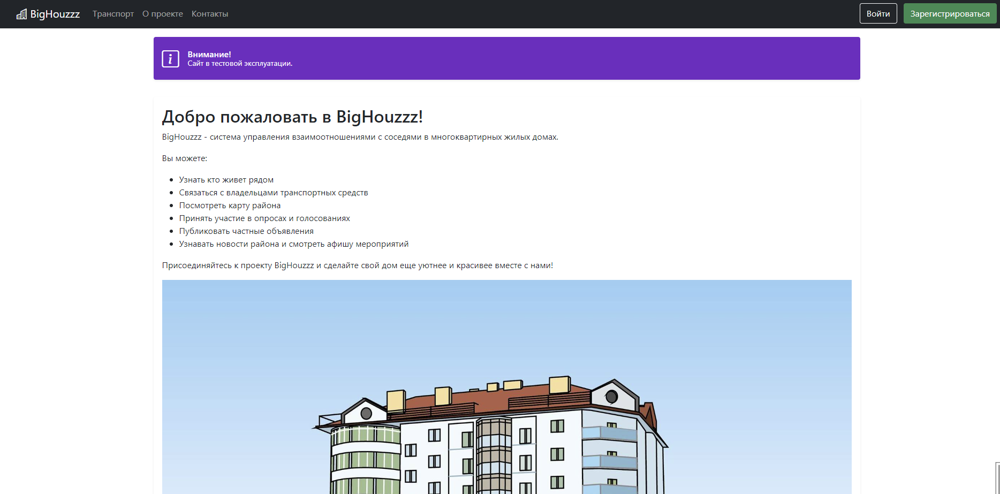
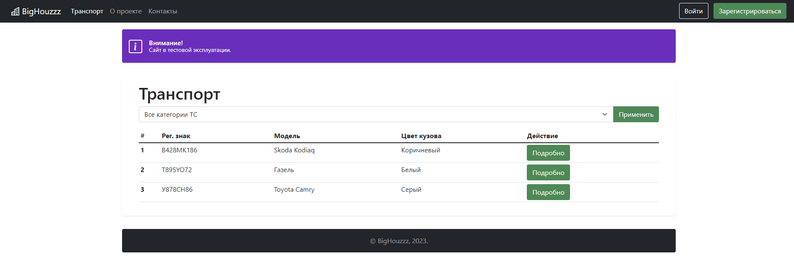
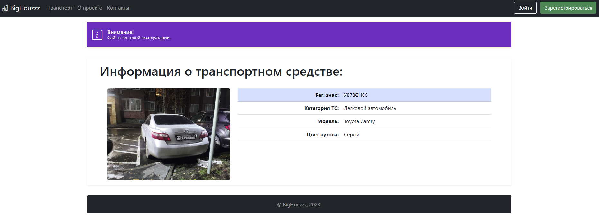

# BigHouzz

🏘️ **BigHouzz** is a full-stack web application for managing relationships with neighbors in multi-apartment residential buildings

The code uses [Django](https://www.djangoproject.com/) as the website engine, and [Bootstrap](https://getbootstrap.com/) for the user interface.

## System Requirements

  * [Python 3.10.1](https://www.python.org/downloads/)
  * Django 4.1.10
  * django-bootstrap v5 1.0.11
  * pillow 10.1.0
  * django-environ 0.11.2
  * django-debug-toolbar 4.2.0
  * Trusted browser: Google Chrome v. 119.0.6045.160 (64 bit)

## 🚀 Features

### Frontend pages
  * Home
  * About
  * Contacts
  * Administration
  * Register
  * Login
  * Vehicle

### Design specification
  * Use Any Bootstrap icon Logo (frontend)
  * Mobile Friendly

### Functionality specification
  * User Registration
  * Vehicles Registration
  * About project and Contact pages
  * Admin module

***TODO and Features will come in the future***

You can see in [TODO](TODO.md).

## Screenshots
  * Home

  * Vehicles Index Page

  * Vehicles Detail Page


## ⚡ Main Technologies
<code>Python</code> <code>Django</code> <code>Django-environ</code> <code>HTML</code> <code>CSS</code> <code>Bootstrap</code> <code>pillow</code> 


## ⚙️ Installation

  1. Clone the repository to your local machine:
```bash
git clone https://github.com/botalov-pro/BigHouzzz.git
```
  2. Create and activate the virtual environment:
```bash
$ python -m venv venv

# Activate the virtual environment in Windows (In git bash)
$ source venv/Scripts/activate

# Activate the virtual environment in Linux/Mac
$ source venv/bin/activate
```
  3. Create a .env file in the project root folder with the following contents:
```python
DEBUG=True
SECRET_KEY='<YOUR_SECRET_KEY>'
```
  4. Install the required python packages:
```bash
$ pip install -r requirements.txt
``` 
  5. Create and Apply migrations:
```bash
$ python manage.py makemigrations
$ python manage.py migrate
``` 
  6. Create superuser to help managing for the first time:
```bash
$ python manage.py createsuperuser
``` 
  7. Load fixtures with demo data:
```bash
$ python manage.py loaddata users/fixtures/users.json
$ python manage.py loaddata core/fixtures/core.json
$ python manage.py loaddata cars/fixtures/cars.json
``` 
 8. Start the Django server:
```bash
$ python manage.py runserver
``` 

**Using the App with local development server**
In the browser go to

  * http://127.0.0.1:8000/ to interact with the app's backend as a user.
  * http://127.0.0.1:8000/admin/ to update records using django's built-in admin module.

## Bugs and suggestions

If you have found a bug or if you have a request for additional functionality, please use the issue tracker on GitHub.

https://github.com/botalov-pro/BigHouzzz/issues

## Author

Developed and maintained by [Konstantin Botalov](mailto:konstantin@botalov.pro)
